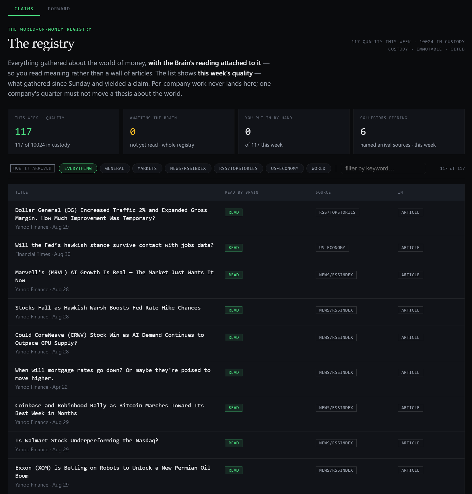

The last two posts were both, underneath, about taking the agent out of the model. [Classify the work](/p/is-this-even-an-agent/) so you know when you're not actually holding an agent, then [bind the ones that aren't](/p/the-deterministic-sandwich/) into bounded workers with the model sealed in the middle. Almost everything I run works that way, because almost everything genuinely is a worker.

This post is about the exception, the handful of places where I do the opposite on purpose and let a worker off the leash. There are three of them in the whole system. This is one, and it's the one that reviews the positions I actually hold, which is about as high-stakes as it gets, so it's the honest place to talk about what it means to let the model loop, and what it takes to sleep at night after you do.

## Why This One Can't Be a Sandwich

The job is a position review. A thing I own moved, or enough time passed that it should be looked at, and something has to decide whether to hold it, add to it, trim it, or flag it. My first version was a [deterministic sandwich](/p/the-deterministic-sandwich/), one bounded model call with the context assembled in front of it, and you can still read that history in the file: the header says it "makes ONE model call." It doesn't anymore, and the reason it doesn't is the whole point of this post.

A fixed control flow has to decide, before it runs, what data to put in front of the model. For a position review, that's the one thing you can't know in advance. The position moved: was it the macro drivers it's formally bound to, or a front-end rate that none of them cover, or an earnings surprise sitting in the news that no macro series names at all? Which of those you need to look at depends on what you find when you start looking, and a sandwich can't do that, because the bottom slice is fixed before the model has seen anything. To chase the real reason a position moved, something has to be able to decide what to pull next based on what the last thing it pulled said. That's not a worker calling a model. That's an agent, and I stopped pretending otherwise.

## Letting It Loop

So this worker's filling isn't one call, it's a tool-using loop. The model reasons, decides it needs something, calls a tool, reads the result, and decides again, over and over, until it has an answer or it runs out of room:

```typescript
const run = await runAgentConversation({
  model: deps.client,
  role: 'nuance',                          // the 26B reasoning model
  messages: agentMessages,
  tools: agentTools,
  maxIterations: 6,                        // it may loop, but not forever
  opts: { maxTokens: deps.reviewMaxTokens }, // thinking ON — this is reasoning work
});
```

The model picks the next step. That's the line that makes this an agent by the [classification I use](/p/is-this-even-an-agent/), and I'm not going to dress it up as anything else. It genuinely decides what to look at next, and I genuinely don't know, before it runs, how many steps it will take or which tools it will call.

The tools it gets are worth listing, because they're the agent's whole world and every one of them is a way to *see*, never a way to *act*:

- **bars**: the recent daily price history, so it can compute the move itself. A frozen mark can't tell you the position ripped or dumped; the history can.
- **series**: the latest value of any macro series by id, so it can check a driver the position's bound winds don't cover and find the real one.
- **news**: recent per-ticker news with a sentiment read, which often carries the real-world reason a move happened that no macro series names.
- **the general read**: a single tool that will GET any read endpoint in the whole system, the same read surface my own tools use, for whatever the dedicated tools don't carry. Its description ends with the only sentence that matters: *it is READ-ONLY; it never writes.*
- **the arc**: the position's own prior recommendations, so the agent reasons in continuity with what it decided last time instead of from scratch.
- **the tax lots and the mandate**: pulled before it ever proposes a book-changing move, so the realized gain and the sleeve's own rules are *in* the judgement, not discovered later at filing time.

Read the whole system, change nothing. That constraint isn't a footnote. It's the first bar of the cage.

## The Cage It Loops Inside

Because here's the thing I want to be exact about: I let this worker be an agent, and I trust it with essentially nothing. Both of those are true at once, and the reason they can both be true is that the freedom and the restraint are aimed at completely different things. The agent is free to *reason*. It has no authority to *act*. Everything the last two posts built is still here, wrapped around the loop instead of replacing it.

The loop is bounded twice over. It runs inside a Kubernetes worker that claimed exactly one position off a queue, so the agent's entire universe is one holding, and it caps at six iterations and a token budget, so a model that wanders can't wander forever. Every tool is a GET, so the worst an out-of-control loop can do is read a lot of data and time out. And the model's final prose still lands on deterministic code that doesn't trust it. The answer is parsed into a structured judgement, and if it can't be parsed, that's an honest recorded gap, never a guessed action:

```typescript
const parsed = await extractJudgement(run.answer, deps);
if (parsed === null) {
  // the agent produced no recognisable action — record the gap, propose nothing
  return { action: null, gapReason: 'parse_failed', /* ... */ };
}
```

The honest-gap vocabulary is the same one every worker uses. A model that isn't wired up, a call that failed, an answer that wouldn't parse: `model_unconfigured`, `model_failed`, `parse_failed`. None of them ever becomes an invented trade. And when the agent does propose a real move, the deterministic code around it still overrules it on the things that aren't its call. If it asks to trim more than the per-action cap allows, the code sizes it down and *says so* in the reasoning, out loud, rather than silently honoring or silently ignoring it:

```typescript
if (amountPct !== null && amountPct > deps.maxMovePct) {
  why = `${why} [sized down from ${amountPct}% to the ${deps.maxMovePct}% per-action cap]`;
  amountPct = deps.maxMovePct;
}
```

And the last bar, the one that actually lets me run this at all: it defers. The agent doesn't execute anything. It produces a recommendation, a proposed disposition, and the operator decides. The real book delta is computed server-side when a human accepts the disposition, not by the model. In the file this is stated as flatly as it deserves: *inference is not a seam.* The agent's reasoning is never itself a change to the system. It's a proposal that a deterministic path, and a person, turn into an action or don't.

## The Limits Live in the Code, Not the Prompt

I said the tools are all read-only, and the prompt says so too, but the prompt is not where that's enforced, and if it were I wouldn't run this. If the only thing between the agent and a write were a sentence asking it nicely, one clever prompt injection or one confidently wrong reasoning step is all it would take. The limits are structural, and they live in three places, none of them the prompt.

The first is the module boundary. The agent never holds a database connection, because it can't. It doesn't import a store, a schema, or another subsystem's internals. Its entire reach into the system is a single injected seam client, which is a base URL and a fetch and nothing else:

```typescript
export interface SeamClient {
  readonly baseUrl: string;   // readonly: a tool can't repoint its own seam mid-turn
  readonly fetchFn: typeof fetch;
}
```

That's not a rule the code is trusted to follow. It's the shape of the package. There's no import that would hand the agent a way to touch a store directly, so its only surface is the API's, and the API's surface is a fixed, narrow set of operations. A worker that physically cannot reach past an HTTP client cannot quietly grow a dependency on a store's internals, which is the exact rot that made [v2 unmovable](/p/why-we-threw-away-portfolioos-v2/).

The second is the tool itself. The dangerous operations aren't discouraged, they're refused in code, before any HTTP call leaves the process:

```typescript
// promotion and retirement are the operator's gates.
// the agent can't even ASK the seam for them.
if (outcome === 'promote' || outcome === 'retire') {
  return jsonError('not available to the agent; operator-only');
}
```

The placement is the whole point. That check runs inside the tool the model calls, before the request is even built, so the model cannot ask the seam to promote a thing, because the tool that would carry the request refuses to make it. And the server route the tool would have hit refuses `promote` too, independently, at its own boundary. The limit is enforced twice, in two layers, and neither of them is a line in a prompt hoping the model behaves.

The third is the capability grant. The set of tools an agent may use is resolved from a capability plane at the start of the run, from what the run was granted, never from what the model asks for:

```typescript
// resolved from the capability plane at run start. discovered is not granted.
// a call to a tool outside the allow-list is recorded — denied — and never runs.
readonly disposition: 'granted' | 'denied';
```

The model can name any tool it likes. If that tool isn't in the allow-list the run was admitted with, the call is recorded with a `denied` disposition and never executes. It's the same distinction running through the whole runtime: what the model can *see* and what the model can *do* are different sets, drawn by code, and the gap between them is where the safety lives.



*The registry the grant is resolved from. Each entry declares what a thing is and what it may reach, so the allow-list a run is admitted with is a fact recorded here, not a request the model gets to make at runtime.*

## Freedom of Thought, No Authority to Act

That's the shape, and once you see it the paradox in the title dissolves. An agentic worker isn't a contradiction. It's a worker whose bounded job happens to be *reasoning*, and reasoning is the one job you can't do with a fixed control flow, so the model is allowed to drive the loop. But it drives the loop inside a Kubernetes worker, over read-only tools, under a step and token budget, with its output parsed by code that assumes it's wrong, its size overruled by code that knows the limits, and its every conclusion handed to a human as a proposal rather than an act.

The three posts are one argument in three moves. Classify the work so you know what you're holding. Bind the workers so the model can't be the architecture. And in the rare place where the job genuinely needs an agent, let it be one, but build the agent a cage out of exactly the same runtime the workers gave you: the worker loop, the budget, the audit trail, the read-only capability grant, the deterministic parse, the deferral to a human. The agent gets to think. It doesn't get to touch anything.

## What This Still Can't Save Me From

I run three of these, and I count them, and I'm nervous about all three, which I think is the correct number of things to be nervous about. Every bar of the cage I just described contains a *wrong action*. Not one of them contains a wrong *thought*. The agent can loop beautifully, pull exactly the right series, read the news, notice the real driver, reason its way to a conclusion that is coherent and grounded and cited and completely mistaken about what to do, and every safety I have will pass it straight through, because a well-reasoned bad recommendation is not detectably broken. It's just wrong.

The cage doesn't fix that, and it isn't supposed to. What it does is make sure that a wrong recommendation stays a recommendation. The agent that reviews my positions is the most capable, most autonomous thing in the entire system, and it cannot move a dollar. That's not a limitation I'm working to remove. It's the deal that makes letting it think for itself survivable, and the day I'm tempted to let one of these three act on its own conclusions is the day I should re-read [the post about the model that read the document right and concluded from it wrong](/p/the-gold-trap-small-models-are-not-interchangeable/), because that model was reasoning beautifully too.
