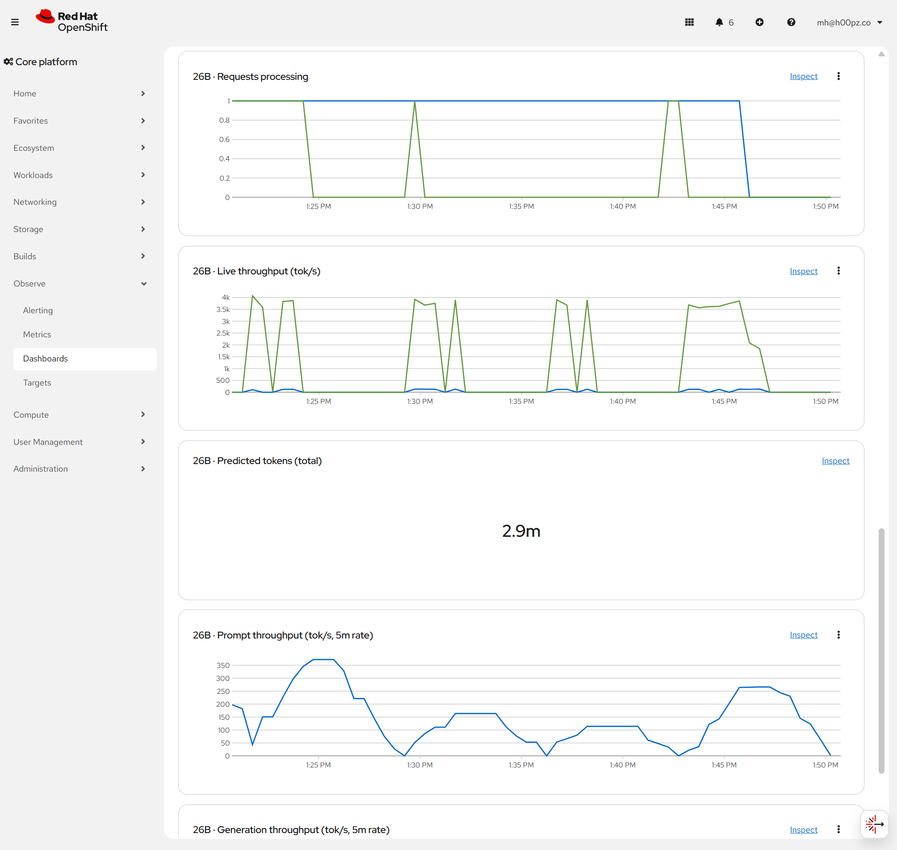

One of my three GPUs isn't a model at all, it's a utility card: a single hot slot that cold-starts whatever specialized model a job needs in the moment, speech-to-text, text-to-speech, embeddings, and vision. "On demand" means a cold start every time a job needs it, and vision, a Qwen2.5-VL, was the heaviest, slowest thing that card ever had to load. Every document that happened to contain an image waited for a whole model to spin up before anyone could read it. It worked. It was miserable. Last night I took two of those on-demand jobs off that card for good, vision and speech, and here's the part that made the whole exercise worth writing down: I didn't move them to another GPU. I folded them into a model I already keep hot, which turned out to have been able to see and hear all along.

This is the third post in the OpenShift-and-AI series, and it's the one where the clean architecture diagrams meet the actual, bleeding-edge, nothing-supports-this-yet reality of running a brand-new model on a managed platform. The short version: the capability I wanted was already sitting in a checkpoint on a disk, the validated runtime the platform hands you flatly could not serve it, and getting from one to the other meant building a piece of infrastructure that does not exist off the shelf. Along the way I took two on-demand models off my utility GPU and made both of their jobs instant, which on a three-card cluster is the only kind of win that matters.

## The Slot Was the Point

Start with why any of this was worth a late night. [The last two posts](/p/your-model-fits-your-context-doesnt/) were about a single scarce resource: not the model, the slot. I have three RTX 3090s, and a GPU is indivisible, so I get exactly three hot slots. Two of them are spoken for by resident models that never move: a 26B for judgment, and a 12B for high-context compilation. The third is the utility card, and it doesn't hold one model, it carousels through its single hot slot, cold-loading whatever a job needs right then: speech-to-text, text-to-speech, embeddings, vision. To be fair to it, "on demand" here isn't the network-download nightmare it could be, because the weights are already staged on a local PVC, so a cold start is a pod coming up and a model loading into VRAM off fast local disk, not a multi-gigabyte pull from somewhere far away. That's quick enough for the light, occasional specialists. It was still miserable for vision, which is heavy enough that even a local load is a real wait, paid fresh on every image-bearing document.

Then I actually read the 12B's model card and felt slightly stupid. The Gemma-4 12B I was already keeping resident as a text compiler is not a text model. Its architecture is `Gemma4UnifiedForConditionalGeneration`, and its config carries a `text_config`, a `vision_config`, and an `audio_config`. It reads images. It reads audio. It reads video. I had been serving a multimodal model as if it could only do text, and paying a cold-start tax on the utility card to do the vision and speech work this model could already do resident. Consolidate that, and one always-hot model covers document text, document images, document audio, and an audio chat interface. Two of the utility card's on-demand passengers, vision and speech-to-text, come off the carousel entirely, because the resident 12B does both itself now, instantly, with no spin-up. The utility slot is left for the genuinely light jobs. That was the whole prize. Everything after this is what it cost to collect it.

## Why It Was Only Doing Text

The reason the 12B was text-only was almost funny in its smallness. It ran under llama.cpp, off a GGUF file, and the GGUF directory on the weights volume held exactly one thing: `model.gguf`, the text weights. No `mmproj`. The vision projector, the piece that turns pixels into something the language model can attend to, simply wasn't there. llama.cpp will happily serve the text half of a multimodal model and never mention that it's ignoring the other two thirds. The capability was in the family, just not in the file I was serving.

So the obvious move was to serve the native checkpoint, the full multimodal safetensors, instead of the amputated GGUF. And that's where the managed platform and the bleeding edge had their disagreement.

## The Box You Can't Tick

Red Hat OpenShift AI gives you a tidy, reassuring dropdown of validated serving runtimes. The one everybody wants is "vLLM NVIDIA GPU ServingRuntime for KServe," because vLLM is fast and the runtime is blessed and supported and appears in the UI with a nice name. I genuinely wanted my models on it. Being a good citizen of the managed platform is worth something: it's the difference between infrastructure the vendor will help you with and infrastructure you own alone at two in the morning.

I tried to tick that box two ways, and both of them failed in a way that taught me something.

First, vLLM against the GGUF:

```text
ValueError: GGUF model with architecture gemma4 is not supported yet.
```

Fine, GGUF is a llama.cpp format, vLLM's loader doesn't know this architecture. Try the native safetensors instead, the proper way vLLM wants to be fed:

```text
model type 'gemma4_unified' but Transformers does not recognize this
architecture. This could be because of an issue with the checkpoint, or
because your version of Transformers is out of date... there may not be
a release version that supports this model yet.
```

There it is. The validated vLLM runtime on this platform ships `transformers` 4.57. The model was saved by `transformers` 5.x, a dev build that hadn't even hit a stable release. The blessed, supported, nicely-named box in the dropdown is not wrong, exactly. It's just from a slightly older week than my model, and for a model this new, "a slightly older week" is the whole distance between working and not. The box was un-tickable, and no amount of clicking it was going to change that.

That's the shape of the bleeding-edge tax, and it's worth naming plainly because it's the recurring cost of running at the front: the managed abstraction that's supposed to make serving easy assumes the model is old enough to be known. The newer the model, the less the platform can do for you, until at the very front you are not a consumer of a serving product at all. You are the person who has to build it.

## Building the Runtime Nobody Shipped Yet

So I built it. Not vLLM, not llama.cpp, but a small custom image around `transformers` itself, new enough to know what `gemma4_unified` is.

New enough turned out to be its own scavenger hunt. The newest version of `transformers` on PyPI has the multimodal loader class but not the `gemma4_unified` module, which lived only in git main. Pulling git main then wants a newer `tokenizers` than the pod's default Red Hat package mirror carries, so that one dependency had to come from public PyPI directly. Every layer of the supply chain was a half-step behind the model, and the image is a record of catching each of them up by hand, pinned to exact versions so it never silently drifts:

```text
torch 2.10.0    transformers 5.16.0.dev0 (git main, pinned to a commit)
tokenizers 0.23.1    bitsandbytes 0.49.2    accelerate 1.13.0
librosa 0.11.0    torchvision, soundfile, pillow, numpy
```

The <a href="https://github.com/h00pz/h00pz.github.io/blob/main/examples/gemma4-12b-mm.Dockerfile" target="_blank" rel="noopener">whole Dockerfile is in the repo</a>, and its base image is a small confession in itself. It's the platform's own vLLM CUDA image, the one attached to the runtime that couldn't serve my model, used purely for its known-good Torch and CUDA layers with vLLM itself never invoked. I borrowed the blessed runtime's body to run the exact thing the blessed runtime refused to.

Around that, an ordinary <a href="https://github.com/h00pz/h00pz.github.io/blob/main/examples/gemma4-12b-mm-serve.py" target="_blank" rel="noopener">FastAPI app</a> that speaks the OpenAI chat-completions dialect the rest of my system already talks, so nothing downstream has to know the runtime underneath changed. It decodes an `image_url` into pixels and an `input_audio` block into a waveform, hands them to the processor, and streams back text. The whole thing is about two hundred lines, and the dtype fix I'm about to describe is four of them. In four-bit, the whole thing loads in about 8 GB of a 24 GB card, which leaves plenty of room for the context.

There was exactly one bug that was genuinely the model's fault, and it's a perfect little artifact of newness:

```text
RuntimeError: expected scalar type Float but found BFloat16
```

The vision tower's normalization weights are stored in bfloat16, but the processor emits the pixel values in float32, and the model doesn't reconcile them before the first vision layer touches them. A released, mature model would have had that papered over long ago. This one hadn't, so I cast the image and audio inputs to bfloat16 myself before they go in, one line, and the vision and audio paths came alive. The proof-of-concept described a blue circle it was shown and correctly heard a 440-hertz tone as a high-pitched metallic sound, which is a deeply undramatic sentence for how satisfying it was at midnight.

Then I built it the way I build everything else in the system, a real image pushed to the cluster's internal registry, a real InferenceService pointing at the native weights, real metrics wired up, and repointed the stable model alias the summarize workers call. That last move fixed all five of them at once, because they were addressing the alias, not the pod, which is the entire reason you put an alias in front of a model in the first place.

## Speaking vLLM Without Being vLLM

There's a smaller thing I did that I'm quietly proud of, and it's the same trick as the base image, run one more time. I couldn't use the vLLM runtime, but I still wanted the vLLM ecosystem's monitoring, all the dashboards and metric conventions the community and the platform have already built and that I'd be an idiot to reinvent. So the custom server hand-rolls a Prometheus metrics endpoint using vLLM-compatible metric names: `vllm:num_requests_running`, `vllm:generation_tokens_total`, `vllm:e2e_request_latency_seconds`, and the rest. My runtime isn't vLLM. It just speaks vLLM's dialect on the wire, at exactly the spot where the monitoring is listening.

That one decision means the off-the-shelf vLLM dashboards render against my not-vLLM runtime without changing a line of them. There's no Grafana on this cluster, so the board I stood up is a native OpenShift console dashboard, a ConfigMap the console picks up on its own, fed from the cluster's user-workload monitoring through thanos. It graphs running and waiting requests, prompt and generation token throughput, and end-to-end latency at the p50, p95, and p99, all for a model the blessed runtime flatly refuses to load. The <a href="https://github.com/h00pz/h00pz.github.io/blob/main/examples/vllm-gemma-console-dashboard.json" target="_blank" rel="noopener">whole dashboard is a small JSON file</a>, seven panels of vLLM metrics pointed at a thing that isn't vLLM. You couldn't tick the box, but you can still have the box's dashboards, if you're willing to teach your thing to answer to the box's questions.



*The console dashboard, rendering standard vLLM panels against a runtime that isn't vLLM. Every series on it is hand-emitted by the custom server so the platform's own tooling recognizes a model it was never built to see.*

Because this series is allergic to tidy stories, two honest asterisks. The time-to-first-token panel is a polite fiction: my server doesn't stream, so it records the whole end-to-end time into the first-token bucket and the panel title admits as much. And the 26B, which runs on llama.cpp and speaks llama.cpp's own metric names, isn't on this board at all yet, because it never learned to talk vLLM. Renaming its metrics to match is a job I've written down and haven't done.

## The Unglamorous Half: Cleaning Up After the Platform

I'd love to say the model work was the whole night. It wasn't. Half of it was untangling a managed environment that had quietly wedged itself, and that half is honest to include because it's what running this actually looks like.

The platform was full of lies. The 12B showed as "stopping" and had been up for thirty-nine days. The model registry claimed its deployment was available and had no pod behind it. The model catalog UI threw a red error box while the catalog backend sat there perfectly healthy, serving seventy-four models to anyone who asked it directly. Every one of these traced back to a mass pod restart over a month earlier, a node reboot that left the operator-managed pieces in states their controllers never reconciled back out of.

The catalog one was my favorite, because it's a classic. The dashboard pod had booted back in May, before a certain certificate got added to the cluster's trust bundle, and it was still holding that stale bundle in memory. So when its UI backend called the catalog over HTTPS, it got `x509: certificate signed by unknown authority` and turned that into a generic 500 for the user. Nothing was actually broken. A long-lived pod was just remembering an older version of what it should trust. The fix was to restart the pod so it re-read the current bundle, which is the infrastructure equivalent of turning it off and on again, and which worked exactly as well.

And "stopping" a model turned out to be a thing this build of KServe doesn't really do. The stop annotation was a no-op, a request for zero replicas was ignored, and the autoscaler floor was pinned at one, so the only way to actually free a GPU was to delete the InferenceService outright. Underneath that, one of my models genuinely couldn't converge because I'd once set its declared format to `vLLM` while its runtime served GGUF, and a controller that can't reconcile a resource will respawn its pod forever while ignoring every polite request to stop. It wasn't refusing to stop out of spite. It was stuck in a loop trying to reach a state it could never reach.

I made my own mess in there too, and it belongs in the record. During the churn of stopping and restarting things I redeployed the 26B with half the memory it needed, caught it, and put it back. And I learned, the hard way and then said out loud, that if you stop and start these things too fast on a GPU-saturated cluster, KServe loses track of which replica set is real and you spend twenty minutes untangling ghosts. None of that is the platform's fault. It's mine, for treating a slow, stateful, GPU-bound system like it was a stateless web app I could bounce at will.

## What the Bleeding Edge Actually Costs

Line it all up and the tax is clear, and it's not really about any one bug. The validated runtime couldn't serve the model because the model was newer than the runtime's libraries. The libraries that could serve it existed only in a git branch. The dependency that branch needed was newer than the internal mirror stocked. The model itself shipped with a dtype mismatch nobody had smoothed over yet. Every one of those is the same thing wearing a different hat: I chose to run a model the ecosystem hasn't caught up to, and the gap between the model and everything around it is a gap I personally have to close, by hand, and then maintain.

Here's the other side of that ledger, though, and it's the reason I'd do it again. Because I own the whole stack, closing that gap was *allowed*. A managed model API would have answered my request to serve `gemma4_unified` with a support ticket and a shrug. My own cluster answered it with a Dockerfile. The sovereignty I keep going on about isn't only cost control or data control. It's the specific freedom to build the runtime that doesn't exist yet, on the night you need it, instead of waiting for someone whose roadmap you don't control. Bleeding edge is a tax, and self-hosting is what lets you actually pay it.

## Where It's Honest to Stop

I won't pretend the new setup is strictly better on every axis. llama.cpp, serving that amputated text-only GGUF, was more memory-efficient with its KV cache than raw `transformers` is, and could hold the full quarter-million-token context on the card. My multimodal image, at the same precision, tops out somewhat lower before I have to start quantizing the KV cache too. So I traded some context efficiency to get vision and audio, which was the right trade for what this model is now for, but it was a trade, not a free win. And I am now pinned to a specific commit of a dev build of `transformers`, which is a maintenance debt with my name on it: the day I update it, something in that hand-assembled dependency stack will move, and I'll be back in the same scavenger hunt. I chose that debt with my eyes open, because one resident model doing three modalities and clearing two on-demand jobs off my utility card is worth carrying it. But it's debt, and calling it anything else would be exactly the kind of tidy story this series exists to avoid.

The vision and speech cold-starts are gone, folded into a model that's always hot, and my utility card has two fewer heavy passengers to juggle. One model reads the documents, sees the documents, hears the documents, and holds an audio conversation, all resident, all on hardware I control. And the cost of that was a night of building the thing the platform couldn't hand me, plus a standing bill I've agreed to keep paying for the privilege of being early. That's the deal at the front edge. It's a real deal, with a real price, and I think it's the right one, which is a different and more honest claim than saying it was easy.
