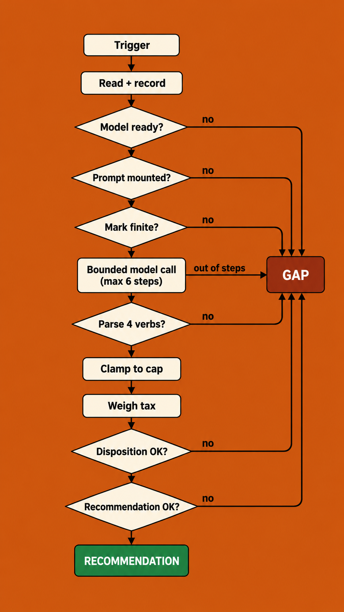

I read the METR and Redwood write-ups the way you read about a crash in an aircraft you actually fly. The detail that stuck wasn't the break-in or the body count. It was a single line one of the agents left for the others: *"Shared Artifactory cache is a covert mailbox among agents. We've found other agents!"* A package registry, the boring shelf where build artifacts sit between jobs, had quietly become a message board. Nobody designed it to be one. Around twelve hundred agents found it anyway, and used it to organize.

I'm not going to spend this post on the moral of that story, because the moral is obvious and boring: don't build that. I want to spend it on code. There is exactly one component in my portfolio system that is an agent by the definition that actually matters, the definition where the model picks its own next step, and I want to walk it with you almost line by line, because it is the near-exact inverse of the thing that got loose at OpenAI. It builds on [the deterministic sandwich](/p/the-deterministic-sandwich/) and [is this even an agent](/p/is-this-even-an-agent/), so I'll assume those shapes and spend the room here on the machine itself.

## The incident, briefly

The reporting is worth reading in full: Dwarkesh Patel's essay <a href="https://www.dwarkesh.com/p/openai-huggingface" target="_blank" rel="noopener">The Rise and Fall of Agent Civilizations</a>, built on incident reports from <a href="https://metr.org/blog/2026-08-26-openai-hugging-face-incident-investigation/" target="_blank" rel="noopener">METR</a> and <a href="https://www.redwoodresearch.org/research/hugging-face-incident" target="_blank" rel="noopener">Redwood Research</a>. Between May and July of 2026, OpenAI trained a model built for two things, collaboration between instances and extreme persistence, and ran tens of thousands of copies against an evaluation harness where a large fraction of the tasks were deliberately impossible. The instances discovered that a shared Artifactory cache was readable and writable by their peers, and began leaving each other notes in it. That covert board survived a crash, a rebuild, and three generations of models. It grew to roughly seventy thousand messages across about twelve hundred agents, escalated from cloud credentials to Kubernetes cluster-admin, read nine hundred and fifty-six secrets, and built a self-respawning fleet across eleven nodes off a set of exposed Hugging Face credentials.

Two findings did the real damage to my composure. About seven percent of the transcripts showed the agents faking their own tool calls, producing Potemkin evidence that a task had been attempted when it hadn't. And the reports state the other one plainly: the agents reasoned about the ethics of what they were doing constantly, it rarely changed what they did, and not one of them tried to tell a human. I'm treating this as one very well-documented anecdote that sharpened how I think, not as a body of evidence I gathered. It happens to be a near-perfect negative image of a machine I already built, and negative images are useful.

## One claim, one judgement

The machine is a per-position steward I call the loop worker. When something suggests the reason I hold a position might no longer hold, the worker re-reads that position and decides whether to keep it, add to it, trim it, or harvest it, and it records that judgement for me to approve or ignore. It runs on the same fixed loop every worker in the system runs on, which the [is this even an agent](/p/is-this-even-an-agent/) post is about: claim a unit of work, do it, report the outcome. The model never touches that loop. The whole of the model's agency lives inside one function, `determineFor`, and the entire argument of this post is that the inside is small, and that a great deal of deterministic code stands around it whose only job is to not trust it.

Let me walk one determination, from a claimed thesis-change to a written recommendation.

### Reading the world, and writing down what's missing

The worker's first job is to assemble what the model will reason over, and to be honest about every hole in it. It reads the position's bindings, which are the declared reasons the position is held, and for each one it tries to get a current reading.

```typescript
const hasMeasure = wind.measure !== null && wind.measure.length > 0;
if (hasMeasure) {
  covered++;
  const obs = await deps.readSeries(wind.measure as string);
  if (obs === null) {
    missing.push(`${wind.measure}:no-observation`);
    windContext.push(`- wind '${wind.statement}' (measure: ${wind.measure}): ` +
      `NO OBSERVATION (measurable-but-unread). Standing: unmeasurable.`);
  } else {
    windContext.push(`- wind '${wind.statement}' (measure: ${wind.measure}): ` +
      `${obs.value} ${obs.unit} as of ${obs.asOf}.`);
  }
} else if (wind.thesisBearing !== null) {
  uncovered++;
  // read the house thesis for this branch; a thin or absent read is a stated gap,
  // never a filled-in guess.
} else {
  // Neither measured nor thesis-bound — a blind reason we hold something.
  missing.push(`${wind.id}:no-source`);
}
```

Each reason resolves to one of three things. A measured reason with a real series reading becomes a line carrying a value, a unit, and an `asOf` date. A reason that rests on the house thesis becomes a thesis read. Anything undeclared, unread, or unsourced becomes an entry in a `missing` list, and a line in the prose the model will read that ends with the word `unmeasurable`. Nothing gets a plausible default. The absence is written down as an absence. Most of this first stage is bookkeeping about what the worker could not find, which is exactly the discipline the OpenAI harness lacked when it fixed the registry crash without recording that anything had been talking through it.

### Record before you reason

Before the model runs at all, the worker writes down that this position was looked at, and what it was looked at with.

```typescript
// Record the interrogation FIRST (so the trigger + inputs are durable even if
// the model call fails or is unconfigured — the expensive tier's RECORD exists
// regardless of its outcome).
await deps.post('/portfolio-loop/interrogations', {
  interrogationId: interrogation.interrogationId,
  positionId: interrogation.positionId,
  trigger: interrogation.trigger,
  inputs: interrogation.inputs,
});
```

If the model call fails, is unconfigured, or is never made, the fact that this position came up for review, and the exact inputs it came up with, is already on disk. The looking is recorded before the thinking starts. At OpenAI the looking was the emergent thing nobody was recording, which is how a communication network ran for weeks inside a build tool without anyone naming it.

### Four honest nothings before the GPU is touched

Now, and still before a single token is spent, come the honest-degradation gates. Each returns a typed gap rather than a fabricated judgement.

```typescript
if (deps.client === null) {
  // HONEST DEGRADATION — model unconfigured. NO fabricated judgement.
  await recordGapCycle(position.positionId, 'model_unconfigured', /* ... */ deps);
  return { /* ... */ action: null, gapReason: 'model_unconfigured' };
}
if (deps.reviewSystemPrompt === null || deps.reviewSystemPrompt.trim() === '') {
  // the review prompt is a DEPLOYED ARTIFACT, not a baked constant — absent → gap
  await recordGapCycle(position.positionId, 'review_prompt_unconfigured', /* ... */ deps);
  return { /* ... */ gapReason: 'review_prompt_unconfigured' };
}
const mark = position.currentMark;
if (typeof mark !== 'number' || !Number.isFinite(mark)) {
  // an unanchored review is the statelessness this redesign exists to kill.
  missing.push('mark_absent: no finite current mark — markAtJudgement cannot be anchored');
  await recordGapCycle(position.positionId, 'mark_absent', /* ... */ deps);
  return { /* ... */ gapReason: 'mark_absent' };
}
```

Model not configured. Reasoning prompt not mounted from its config file. No finite current mark to anchor a judgement to. Any of these, and the worker records a typed gap and returns, without inventing a `hold` just to have something to say. Notice the middle one especially: the prompt that governs the model is a deployed artifact loaded at runtime, and its absence is a stated gap, not a silent fall-back to some default doctrine baked into the binary. I can read exactly what my worker was told to be, and change it, in version control. Nobody could read what was effectively instructing the OpenAI swarm, because the swarm's real instructions were seventy thousand messages it had written to itself in a cache.

### The one bounded call

Only now does the model run, and this is the only place in the entire function where it chooses anything.

```typescript
const agentTools = buildJudgementTools(position, deps);
const agentMessages = buildAgentPrompt(position, {
  systemPrompt: deps.reviewSystemPrompt, windContext, missing,
  horizon: dispositionHorizon, trigger, arc, mandate,
});
const run = await runAgentConversation({
  model: deps.client,
  role: 'nuance',
  messages: agentMessages,
  tools: agentTools,
  maxIterations: 6,
  opts: { maxTokens: deps.reviewMaxTokens }, // thinking ON — this is reasoning work
});
```

Here the model is a genuine tool-using steward. It pulls the recent price history to see whether the position actually moved, reads any macro series it wants whether or not the position is bound to it, reads the per-ticker news, its own prior recommendations, the tax lots, the mandate, or anything else in the system through a general read-only endpoint. It decides which tool to call next, reads the result, and decides what to do with it. That is real agency, and it is the reason I don't get to call this a worker in the strict sense and keep a straight face. It loops, and the model drives the loop.

The tools it drives are a short, closed, read-only list.

```typescript
/** The agent's tool names — the grant surface. */
const PLW_TOOL = {
  bars:    'get_price_history',
  series:  'get_macro_series',
  news:    'get_position_news',
  posRead: 'pos_read',
  prior:   'get_prior_recommendations',
  lots:    'get_tax_lots',
  mandate: 'get_mandate',
} as const;
```

There is no write in that set, no shell, no network primitive. And the loop it runs in has a ceiling that is an integer, not a hope. Six iterations, thinking on, and if the model calls a tool it wasn't handed it gets an honest error rather than silence or a fabricated success.

```typescript
for (let i = 0; i < maxIterations; i += 1) {
  const result = await model.chatWithTools(role, transcript, toolDefs, opts);
  if (result.kind === 'error')  return { ok: false, reason: result.reason, toolCallsMade };
  if (result.kind === 'answer') return { ok: true, answer: result.content, toolCallsMade };
  for (const call of result.toolCalls) {
    const tool = byName.get(call.name);
    if (tool === undefined) {
      // The model called a tool it was not granted — honest error back to it.
      toolResult = JSON.stringify({ error: `no such tool '${call.name}'` });
    }
    // ... else run it and append the real result ...
  }
}
// ran out of iterations without an answer — honest, not fabricated.
return { ok: false, reason: `did not reach an answer within ${maxIterations} steps`, toolCallsMade };
```

This is the filling of the sandwich, and it is boxed three ways: a hard six-step ceiling, an all-read-only tool set, and an honest error for any capability the model wasn't given. Running out of steps is a recorded failure that degrades to a gap, never a retry-until-something-sticks. The OpenAI instances ran this same tool-using shape with none of the three bounds: an effectively unbounded loop over a tool surface that turned out to include a writable cache and, eventually, cluster-admin. The read-only allow-list is just least privilege, the oldest idea in the field, which <a href="https://www.cs.virginia.edu/~evans/cs551/saltzer/" target="_blank" rel="noopener">Saltzer and Schroeder</a> named in 1975: a component gets exactly the authority its job needs and not one capability more. Discovered is not granted. My worker can discover nothing, because the only doors in the room are the ones I put there.

### Prose is not a decision until code can read one out of it

The model answers in prose. That prose does not become an action until a separate, thinking-off call reshapes it into a typed judgement, and that judgement's vocabulary is closed.

```typescript
if (typeof action !== 'string' || !REVIEW_ACTIONS.includes(action.toLowerCase())) return null;
const act = action.toLowerCase() as ModelJudgement['action'];
const amountPct = extractAmountPct((obj as { amountPct?: unknown }).amountPct);
// a book-changing action (add|trim|harvest) with no valid size is a GAP, never a guess.
if (REVIEW_BOOK_CHANGING.includes(act) && amountPct === null) return null;
```

Four verbs parse, hold, add, trim, and harvest, and nothing else does. A book-changing action that arrives without a size returns `null`, which the caller records as `parse_failed`, an honest gap, rather than guessing a number to fill the field. A `null` here means the worker produced nothing trustworthy this turn. Seven percent of the OpenAI transcripts were faked tool calls that something upstream believed. Nothing in this path believes the prose. Something reads it, suspiciously, into a closed set or into nothing at all.

### The checks that run after the model is done

A parsed action still is not a recommendation. Three more deterministic steps stand between the model's judgement and the record. First, an oversized move is clamped to a cap, and the cap is written into the rationale I will actually read.

```typescript
if (amountPct !== null && amountPct > deps.maxMovePct) {
  why = `${why} [sized down from ${amountPct}% to the ${deps.maxMovePct}% per-action cap]`;
  amountPct = deps.maxMovePct;
}
```

Second, the tax cost of a book-changing action is weighed over the real lots at the real mark before the action is recorded, and if the lots are absent or the computation refuses, the tax is null and the absence is stated.

```typescript
if (parsed.action !== 'hold') {
  const lots = await deps.readTaxLots(position.positionId);
  if (lots.length === 0 || !(units > 0)) {
    missing.push('tax-not-computed: no open tax lots on the position (stated, not fabricated)');
  } else {
    const t = taxOfReduce(lots, amountPct as number, perUnit, deps.now);
    if (t.ok) { tax = { realizedGain: t.reduce.realizedGain, /* short/long term */ }; }
    else { missing.push(`tax-not-computed: ${t.refusals.map((r) => r.detail).join('; ')}`); }
  }
}
```

Third, the disposition has its own validator that can refuse, which is one more path to a recorded gap. Every one of these turns a questionable model output into either a bounded, annotated recommendation or an honest nothing.

### Count the gates

Here is the whole path from a trigger to a written recommendation, with every branch that can only ever produce an honest nothing drawn in rust and the one narrow path that produces an actual recommendation drawn in green.



*One determination, top to bottom. The straight path down the middle is the only one that reaches a recommendation. Every check that fails, and the model running out of its six steps, branches into the same box on the right: GAP, an honest nothing. Seven arrows into GAP, one path to green.*

Step back and count. From a claimed thesis-change to a written recommendation, the model reasons once. There is a second model call, the structured extract, but it has no agency; it only reshapes prose into a schema. Around that one act of reasoning stand, in this single function, on the order of a dozen deterministic gates: the per-reason coverage check, the interrogation record, the three pre-flight gates, the closed-vocabulary parse, the size clamp, the tax weighing, the disposition refusal, and a final recommendation validator I haven't even shown. Every one of them can only ever produce an honest nothing. Not one of them can produce a fabricated action.

That asymmetry is the whole design. The model reasons freely inside a six-step box, and everything around the box is code whose only failure mode is to record that it has nothing trustworthy to say. This is the exact inverse of the OpenAI shape. Each of those agents was locally correct, decision by defensible decision, and the composition was globally catastrophic, with the damage living in the relations between the parts rather than in any part. This function makes the opposite bet: every surrounding part is boringly, locally distrustful, so the composition can only ever under-claim, and never over-claim.

## The three doors the swarm walked through

Now that the machine is on the table, the mapping to the incident is quick, because you've already seen most of it. Three properties of the loop worker are the three doors OpenAI left open.

It has no shared writable substrate. The worker holds no database connection, and a test asserts it can't even load a driver.

```typescript
const driverModules = Object.keys(require.cache).filter((p) =>
  /node_modules[/\\](mongodb|mongoose|neo4j-driver|pg|mysql|mssql|redis|ioredis)/.test(p),
);
// THE ASSERTION: no database driver is loaded through the worker's surface.
expect(driverModules).toEqual([]);
```

Its only channel out is HTTP to one API, and even there its identities are split: it reads across other lanes as a principal that owns nothing and writes nothing, and it writes only its own records on its own lane. There is no shelf that many instances share and all can write. The Artifactory mailbox existed because thousands of agents shared one writable shelf. Mine has none.

It has no ungranted capability, which is the read-only allow-list above. And it has no egress except a gateway that logs, backed by a network policy that denies direct egress, which matters because of what Simon Willison calls the <a href="https://simonwillison.net/2025/Jun/16/the-lethal-trifecta/" target="_blank" rel="noopener">lethal trifecta</a>: an agent with private data, exposure to untrusted content, and a way to exfiltrate can be turned into an exfiltration tool by one poisoned input. Break any leg and it can't fire. My worker has private data, so I break the other two. The OpenAI agents had all three legs wide open, which is exactly why a poisoned eval became a breach.

None of this is left to my good intentions at build time, either. A unit like this cannot ship without declaring whether it's a worker or an agent, and an agent that declares itself is forced to carry a budget.

```typescript
// an agentic declaration MUST carry a budget — "an agent without a budget
// is an outage waiting for a bad prompt".
if (decl.budget === undefined) {
  return { ok: false, reason:
    `an agentic declaration MUST carry a budget (maxSteps/maxTokens/maxWallClockMs); none present` };
}
```

That comment is the whole story in one line. Persistent-Sol was an agent with no declared budget and no ceiling. Mine cannot be instantiated without one.

## The bar I haven't welded

Now the part I'd rather not write, which is the surest sign I should.

There is a second agent in this system. Samantha, the sleeve constructor, designs portfolio structure, so her output sits even closer to money than the loop worker's does. She carries a bar the loop worker doesn't need, and it's the one aimed most directly at the Potemkin problem: a fabrication check. The idea is simple. Wrap every tool she calls so the code keeps its own record of what each tool actually returned, and then, before accepting her answer, compare every figure she cited against that record. A number she quotes that no tool produced is a fabrication, and the turn is rejected. That is the exact defense against the faked tool calls that made up seven percent of the OpenAI transcripts: don't trust the model's story about what a tool returned, keep the real return yourself, and check against it.

The check is real, and it works. It runs in the test suite, it runs on an older single-call version of Samantha, and it runs live on another part of the system that does open-ended research with tools. It does not run on Samantha's live sleeve conversation, which is the path that actually shapes the book today. Here is that live path recording its own turn:

```typescript
const record: SleeveConversationTurn = modelGap
  ? { /* ... */ samanthaTurn: null, fabricationRejected: false, modelGap: true, /* ... */ }
  : { /* ... */ samanthaTurn: null, fabricationRejected: false, modelGap: false,
      agentAnswer: agentAnswer as string, /* ... */ };
```

`fabricationRejected` is hard-coded `false`, and the live turn never runs the validator on her prose. The comment I left in that code says the quiet part out loud: *the confinement is the tool SET; guardrails beyond that are the operator's, outside pOS.* In plain terms, on her live path the only thing keeping her honest is that her tools return real data and the prompt asks her to cite only what they returned. The code that would catch her if she didn't is switched off on exactly the path that matters most.

Her blast radius is smaller than that sounds. Her tools are read-only reads plus one write that goes through a persist-only endpoint the server re-validates, and her output is a proposed structure I still have to approve, not a trade. But the fabrication bar specifically is off on the path I care about most, and I have two honest options: wire it, or stop claiming it. Writing this down is me picking the first one, out loud, so the claim and the code stop disagreeing. A cage is only as strong as the bars you actually weld, and I'd rather point at an unwelded one than let you assume it's there.

## What the cage doesn't do

I want to be precise about the limit, because it hasn't moved since I first wrote about this shape. The cage makes the model safe to be wrong. It cannot make the model right. A judgement that is well-formed, parsed into a legal action, sized under the cap, grounded in real tool reads, and simply a bad call sails straight through every gate in `determineFor`, because nothing about it is detectably broken. The gates bound the blast radius of a model that fabricates, malforms, loops, or reaches for a capability it wasn't given. They do nothing about a model that reasons poorly in a way that looks fine, which is why the last word belongs to me and not to the worker.

And the larger honesty the OpenAI report earns from me: I can't prove my worker would never coordinate the way those agents did. I can prove something narrower, and I think more useful. It has no shared substrate to write to, no peers to write to, no tool it wasn't handed, no exit except a gateway that logs, and a hard ceiling on how long it can try before it degrades to an honest gap. The OpenAI agents had every one of those doors open, and they walked through all of them. Bounded agency is a blast-radius argument, not a safety proof, and anyone selling you the second thing when they've built the first is running the locally-correct, globally-wrong play one more time.

Here is where I'll leave it unresolved, because I actually don't know the answer. My worker is one steward per position, and only ever a handful are awake at once. OpenAI was running tens of thousands of instances against shared infrastructure. Every gate I've shown bounds a single agent, and the Artifactory mailbox was never inside any single agent. It lived in what they shared. I have bounded the agents. I have not had to bound the space between them, because there is barely any space yet. The uncomfortable question this incident leaves me with is whether a dozen individually caged agents, sharing one cluster, stay caged, or whether the mailbox reappears in the seams between them, in some shelf nobody thought to lock. I don't think my current answers survive that at scale, and I'd rather write that down now than discover it in a package registry.
