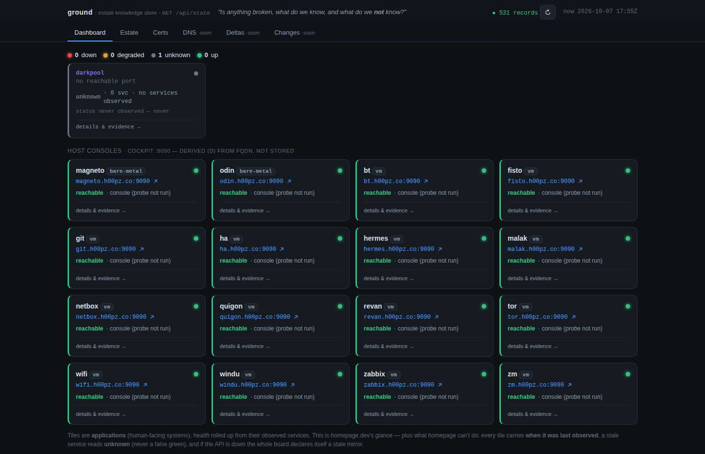

Last time out I wrote a post called "Everything Is a Write Path," and I ended it with a line I now want back.

I said the fix was two workers, an explorer and a collector, and that once you named the missing read path you wouldn't have to replace anything underneath it: no new state layer, no new CMDB, "nothing to procure, nothing in the network path." It was a clean way to end a post. It was also wrong in the exact way I keep warning other people about, where every individual sentence is defensible and the thing they add up to isn't.

Because when I sat down to build it, the first thing I built, and by a wide margin the biggest, was a store. A CMDB, if you want to be rude about it. The two workers I'd led with turned out to be the easy half. The thing I'd dismissed in a single clause was the load-bearing wall.

So this is the build report on all three: the store I didn't think I needed, the two workers I did, and the one honest failure that only showed up once the whole thing was running against a real house. It works. It renews certificates at home with NetBox nowhere in the loop. And it corrected me, twice, which is the best thing a tool can do and the most annoying.

## The store I said I wouldn't build

Here's the correction, stated plainly so I can't weasel out of it later.

The write-path diagnosis from last time, three systems each mistaking its own writes for reality, was really a diagnosis of one thing: the *store*. Terraform state, a NetBox or ServiceNow CMDB, and an Ansible inventory are the same object under the hood. They're mutable-row assertion stores. A field holds one value, the last thing written, and that's the end of what it can tell you. It doesn't know who claimed it, when anyone actually looked, or whether it's still true. You can't ask a store like that "what is the current state of this, and can you vouch for it," because it was never built to answer. It only knows what it was told.

You can't bolt a read path onto that. The read path has to *be* the store, or it's just one more opinion in the pile. So the real first job, the one I'd waved off, was building a store whose native unit is an observation with provenance instead of a value with amnesia. I called it `ground`, and four things make it structurally different from a CMDB, not different by policy but different in the data model itself.



**It's an append-only log, not a mutable row.** Every write is a field-level fact appended to an immutable log, and "current state" is a projection derived from that log, replaced atomically on each write. Nothing is overwritten in place. That's what lets the store answer "how did we come to believe this" and "what did it say last Tuesday," which are exactly the questions a mutable row destroys on every update. If the split sounds familiar it should. It's CQRS and event sourcing in work boots, the write model and the read model kept apart on purpose.

**Every fact carries a grade, and the validator enforces it.** A fact is tagged **A** for asserted (a human claims it), **O** for observed (a collector read it, with the command that produced it attached), or **D** for derived at read time and never stored. Each field has a fixed ownership class, and the ingest validator rejects a write whose grade doesn't match:

```
grade 'A' does not match field class 'O' for host.<field>
```

That one line is the "everything else is a claim" argument from last time turned into code you can't talk your way past. The store can't be tricked into filing an assertion as an observation, because the two have separate doors and a bouncer on each. A CMDB has no such axis. A value is a value, and its provenance lives in tribal knowledge and a comment somebody left in 2019. As I write this the live store holds 123 records across hosts, IPs, certs, and change records, and the grade split is 541 asserted, 303 derived, 169 observed. The 303 derived fields are computed fresh on every read and stored nowhere, which is the quiet anti-NetBox move: change a convention once, not across N rotting records.

**A stale observation renders as unknown, never as its last value.** This is the one that would get me thrown out of a CMDB vendor's office. An observed field past its freshness window doesn't show you the last thing it saw. It shows you `unknown(stale)`, value blanked, computed at read time against the clock. NetBox will happily show you a three-year-old "16GB" as though it were fact. Ground tells you, to its own detriment, that it can't currently vouch for that. The store models the decay of its own knowledge, which is a genuinely un-fun feature to build and the whole point.

And it's the whole point on purpose, because this is the one thing I actually designed the CMDB to do: deliver a *fresh* answer over the API. Freshness isn't stamped in when the fact is written, it's evaluated at the moment you ask, every single GET, against the clock right now. The same stored fact comes back fresh or `unknown(stale)` depending on when you hit the endpoint, because whether I can vouch for something has nothing to do with when I learned it and everything to do with how long ago that was. So the API's contract is narrow and, once you've been burned by the alternative, kind of thrilling: it will hand you a value or it will hand you an honest "I can't currently stand behind this," and it will never, ever hand you the second thing dressed up as the first. Every read-path consumer downstream gets to be dumb about time, because the store already did the thinking about it.

**"Unknown" isn't one thing.** A fact the collector couldn't determine is written down as unknown *with a reason*: no data, not yet observed, or stale. Of 18 cert records right now, 6 render `issued`, 3 render `expired`, and 9 render unknown because the collector hasn't reached them yet, and those 9 are reported as coverage holes, not silently dropped. A read layer that can't tell "I couldn't reach it" from "I reached it and wasn't allowed in" from "this is unreadable by construction" will lie about the shape of its own gap, and that gap is the one number the whole system exists to make honest.

I'm not the first person in this room, and it'd be arrogant to write any of this without saying so. ServiceNow has fought the CMDB version of this for twenty years, and their scar tissue is the good kind, the kind somebody wrote down. The lesson they land on is a separation of jobs: who's allowed to design the schema, who fills it in, who arbitrates a conflicting write, and how discovery actually runs are four different jobs with four different owners, and fusing any two of them is where the thing rots. Their common data model is a human-authored grammar that discovery is forbidden to touch. Their class hierarchy has one rule, "extend the right ancestor, never branch flat." And every source on earth writes through one gate, the Identification and Reconciliation Engine, which is the part I'd rebuilt without knowing it existed. Its reconciliation rules say only an authoritative source may write a given attribute, which is grade-O owns observed, grade-A owns asserted, and nobody else gets a key. Its data-source rules can bar a source from creating records at all, which is exactly the explorer: it proposes, it never inserts. Finding out the incumbent had walked to my grade model from the opposite end of a twenty-year hallway was equal parts reassuring and deflating.

The sharpest thing I took from their playbook, though, is a warning about the intelligent worker, and it's the one that should have saved me a week later on. Point default Kubernetes discovery at a cluster and it happily clutters the CMDB with every pod, deployment, and node it can find. That's sprawl, and sprawl is death. ServiceNow's own fix for the OpenShift case, which is precisely my world, is a *human* defining one class, "OpenShift Virtual Machine," and storing the messy k8s context as plain columns so not one pod ever spawns its own record. A person decides "this is one thing, the rest is noise," and discovery is structurally forbidden from deciding otherwise. That's the entire guardrail against my explorer drifting into three hundred types: humans own the vocabulary, the agent proposes membership against it and can't mint a new class, full stop. Where I get to be a little smug is the two places ground improves on the incumbent instead of copying it. ServiceNow fused "class" and "storage table" into one axis, so every new kind of thing is a new table and the sprawl is baked in; ground keeps them apart, a small fixed set of storage kinds and an open, human-owned profile layer for class, so a new kind of thing is a flat, diffable profile definition and not a schema migration. And even with all four pillars, their CMDBs still go stale in months without a periodic human audit they literally call data certification. The explorer's drift loop re-observes continuously, which is that same audit run every night instead of every quarter. Freshness again, all the way down.

## The two workers, which were the easy part and I mean that as a compliment to the design

With a store that could actually hold a graded, time-stamped, evidence-backed observation, the two workers became small. That's the tell that the design was right. When the hard part is in the right place, the rest gets boring.

The **explorer** is the one genuinely intelligent worker in the estate, and it exists for exactly one job you can't script: walking up to an unfamiliar host and reasoning out what it is. Not running a checklist. Reasoning. Its own charter says it out loud, and I'll quote it because I'm proud of the line: "If you catch yourself walking a fixed list of commands, you have become an Ansible playbook that runs Python. Stop, and investigate instead." It does the skeptical-sysadmin walk, listening socket to process to on-disk binary to owning package to installed version, deriving each step from the last output instead of guessing package names it expects to find. I ran it against a host called quigon and it came back with 27 evidence-cited fields: the pihole-FTL service and its version read off the actual binary, the ports, the TLS endpoints, and the part that matters most for what comes later, the FTL and gravity databases *with their sizes*. That last bit is the whole backup argument made concrete. It didn't back up a 400GB VM image. It found the roughly 12GB of state that actually matters, because it went and looked. It also flagged three things that didn't belong: a hand-installed binary no package owned, a stray swap file, and a root-owned stale database. Not as accusations, as evidence-backed oddities for a human to judge.

The thing that keeps that from being a party trick is a distinction I had to get exactly right or the whole worker collapses, and it's worth stating because it's the opposite of where most people put the rigor. There are two determinisms in play and only one of them is allowed. The *recipe* must be deterministic: a frozen probe set and a versioned parser that, replayed over identical host output, yield byte-identical fields. The *exploration* must not be: the investigation reasons each next command from the last output, and a scripted exploration finds only its own checklist items and is blind to exactly the unexpected thing I paid for an agent to catch. So the rule is to put the determinism in the output, never in the act. Script the walk and you've rebuilt the Ansible playbook the charter forbids; the agent earns its inference cost only in the part that can't be a checklist.

What the agent is actually doing breaks into three depths, and naming them is what keeps "an LLM pokes at hosts" from being as reckless as it sounds. *Existence* is bottom-up and needs no target list: the hypervisor knows its own VMs, DNS knows its names, a subnet knows who answers, and anything present in the substrate but absent from the store is a discovery. *Classification* is the irreducible core, the one genuinely non-scriptable act: the first time a novel kind of thing appears there's no profile and no recipe, so the explorer reasons a class from evidence ("runs an LLM agent loop plus git plus ssh, looks like an agentic-harness") and *proposes* it. It is structurally forbidden from minting the class itself, because that path ends in three hundred types and a CMDB that's all spaghetti and no meal. A human ratifies the vocabulary; the agent only ever argues for membership in it. *Characterization* is the thorough walk once a thing is roughly placed, and it's the one that, when stable, freezes into a recipe.

The discipline that makes all of that safe to run unattended is one line: autonomy to *look*, never to *conclude*. The explorer may run any read-only command and reason about anything it sees; it may not assert a verdict. "bash history shows `buildah build` run by uid 1002, corroborated by a systemd timer" is a grounded finding. "Bob installed a cryptominer" is an accusation pulled from an exit-code-less line, and it's forbidden. A claim with an observation behind it is a fact; a claim without one is a hypothesis and has to be marked as one, visually distinct, for a human to judge. History suggests; the filesystem confirms. The whole charter is short enough to read in one sitting and <a href="https://github.com/h00pz/h00pz.github.io/blob/main/examples/ground-explorer-investigation.md" target="_blank" rel="noopener">reproduced in full in this site's repo</a> — it's the actual skill the agent runs under, not a sanitized summary of it.

Here's the design move that makes the intelligent worker affordable: the explorer's *output* isn't a report, it's a recipe. A frozen set of probes plus a deterministic parser. It figures out how to read a class of thing exactly once, a human ratifies it, the recipe becomes a first-class record in the store, and then the explorer is done with that class, maybe forever.

That ratification is the same design ServiceNow settled on, and it's worth pinning there, because it's where I nearly talked myself into a mistake. Remember IRE, the single reconciliation engine every source has to write through and never around. Ground's small version of it, the grade model plus the validator, gets no exceptions, and the recipe doesn't get to be one. A recipe, a profile identification ("this host is a pi-hole"), and the CIs that fall out of it all go back in through that one write gate, graded and validated, or they don't go in at all. That single door is the entire reason there's one source of truth here instead of three. The moment a recipe became authoritative somewhere off to the side, ground would have a rival store sitting next to it, and I'd be counting write paths again, which is the one thing this whole series exists to stop.

A recipe teaches you how to read a *class* of thing. What I actually want to know is everything true about one specific *application*, and that rolls up into a model my estate named, with the exact gallows humor this whole project runs on, a CRAP: a Complete Recreatable Application Package. Yes. The operational spine of my entire house is called CRAP, and I've made my peace with it, because the name is at least honest about how the alternative usually turns out. A CRAP is the composed answer to one question: what makes this application *this* application, observed, enough to back it up, cert it, monitor it, meter it, and rebuild it from nothing? The important word is *composed*. I never hand-author one, because a hand-authored deployment doc rots the instant you save it, which is the disease this entire series is about. Ground stores thin, graded facts and composes the CRAP on read, the same store-thin and derive-rich move as everything else in here, so Ansible gets one resolved blob to act on and the store stays simple to update.

The piece of a CRAP I care about most is the state bundle, because it's the part you can't fake. For each stateful thing it marks what's config (lives in the store, diffable, the operational surface you actually review), what's data (goes to backup, and *this* is the 12GB that matters), and what's a secret (a reference in the store, the value in the vault). That's the pihole databases with their sizes from a few paragraphs ago, promoted from a nice observation into the literal backup scope. The rebuild half is observed pinned versions plus an ordered set of steps, and those steps are the one part you can't purely observe, which is exactly why they get validated against the only honest oracle infrastructure has: boot the thing in a sandbox and run its healthcheck. And once a CRAP exists, the explorer's steady-state job is to watch it and never touch it. A value that changed gets snapshotted. A *shape* that changed, a new port, a moved config path, a service that appeared, gets proposed as a CRAP-update for a human to ratify. That drift loop is what keeps the package from rotting, it's the continuous certification I was smug about a minute ago, and it is, one more time, freshness: a CRAP you can trust only because something is always checking whether it's gone stale.

The **collector** is the deterministic worker that replays the recipe. It runs the frozen commands, parses the raw output with code, and files graded-O facts into the store. No model in the loop here, because the collector is one of the deterministic edges. That's the deterministic sandwich I've written about before, and I mean the shape literally: deterministic code on the outside, the model allowed to work only in the soft middle, never at a boundary. Raw evidence gets captured by code, a model interprets it once, and then deterministic code files what comes out, with the human-reviewed recipe as the boundary that lives in the store. The critical rule is that the explorer hands over *raw captured output*, never its own conclusions, so every field the collector files is checkable against evidence a human already signed off on. And the collector is the only actor that gets to say "something changed," because it's the one sitting next to the store with the memory to diff against. A new or shape-changed thing gets held in the store as a pending change, with the grounded diff attached for a human to ratify. Once a person approves, the change advances in the store from pending to applied, and the collector re-observes. Observed state on a thing that's already ratified just flows, no approval, because there's nothing new to decide.

The frequency of the explorer is the health metric for the whole system. If it's running on every host every night, the design has failed and I'm paying inference to rediscover what a frozen recipe already knows. It should trend toward idle and spike when something genuinely new appears, and the spike *is* the discovery happening. That's drift detection at the schema level, the thing none of the three write-path systems can give you, and it falls out of the design for free.

## Then it worked, which is the part I have to earn

A store and two workers are nice things to have opinions about. What I wanted was a control loop that closes on observation instead of on hope. So I pointed the whole apparatus at the dumbest, most honest problem in my house: certificates.

The collector reads served certs, ground records their expiry as grade-O facts, a work-query answers "who needs a cert renewed and can you currently vouch for that," and Ansible, demoted from source of truth to blind actuator, renews exactly the hosts it's handed. No NetBox anywhere. Here's a real run, trimmed:

```
BEFORE:  /api/work?predicate=cert  ->  git, revan, odin-ipmi   (3 expired, observed)
ACTION:  AAP renews git + revan   (ground inventory, no NetBox in the path)
AFTER:   collector re-observes the served certs; git + revan advance to 2026-12-23
         /api/work?predicate=cert  ->  odin-ipmi               (3 -> 1)
```

Notice what closed the loop. Ground never wrote "renewed." Ansible reported `changed: true`, and ground ignored that report entirely and went and *looked*, re-observed the served certificate, saw the expiry had actually moved, and only then did the work-query shrink. I even checked the checker: the new expiry got read back independently with `openssl s_client` and matched what the store believed. The loop closed by re-observation, not by assertion. That's the falsifiable proof the last post promised and didn't have, running on real hosts at home.


The word doing the quiet work in that work-query is *fresh*. "Who needs a cert renewed" is the easy half. "And can you currently vouch for that" is the half that keeps a blind actuator from doing something stupid. So the gate has a knob. By default it returns only records that both need work *and* are currently vouchable, and any target whose keying observation has gone stale is held back rather than handed to Ansible, because the store won't let an executor act on something it can't presently stand behind. That's the collapse of two thousand lines of `when:` conditions scattered across playbooks into one honest question asked once, in the store, where the freshness actually lives. You can force the gate open when you distrust the last look and want to over-run post-incident, but you have to opt *into* that, you never fall into it, and when you do, ground writes an audited event recording that the safety was deliberately lowered and how many stale targets it would otherwise have held back. A lowered gate is itself a fact with provenance, not a silent default. That directly answers the fear I ended the last post on, that the automation would quietly redefine what it's allowed to touch on a Tuesday.

The thing that actually carries those targets across the fence to Ansible is a custom dynamic inventory, and it's worth showing, because it's the "blind actuator" idea made real. Ansible would call it an inventory plugin. Mine is a stdlib Python script of about 140 lines (<a href="https://github.com/h00pz/h00pz.github.io/blob/main/examples/ground-inventory.py" target="_blank" rel="noopener">reproduced in full in this site's repo</a>), and the fact that it *can* be that small is the whole point. On each run AAP calls it, it makes one GET against the freshness-gated work-query — literally `/api/work?predicate=cert&fresh=on` — and it reshapes the answer into an Ansible inventory: a `cert_work` group holding exactly the hosts that need a cert and that the store can currently vouch for, each one carrying its observed facts and their provenance as host vars, down to which services the renewal should push to, derived from the host's profile tags. Two rules keep it honest. It emits *observed* state, never desired state, so Ansible acts on what the store saw needs doing and not on a hand-maintained "should exist" list that rots the moment it's written. And it does almost nothing else, no group logic, no caching, no cleverness, because the store already did the needs-work-and-fresh thinking before the script ever ran. It's thin *because* the intelligence lives in the store, which is the same sentence I keep writing about every part of this thing.

And that `fresh=on` is doing more than keeping a blind actuator safe — it's what stops the whole estate from re-doing work that's already done. A host whose cert is fresh and valid isn't filtered out downstream by a `when:` after Ansible has already connected to it; it never enters `cert_work` in the first place, so there's nothing to connect to. I am not running a renewal play against sixteen hosts every night and trusting conditionals to skip the fourteen that are fine. The store hands the inventory the three that are genuinely due and withholds the thirteen it can still vouch for, and the play only ever sees work that's real. That's the difference between freshness as a property you can *act on* and freshness as a comment somebody left in a playbook: the former shrinks the target set before a single SSH handshake, every run, automatically, and the already-fresh things stay untouched precisely because the store already knows they're fresh.

When I ran the real cert cutover, AAP synced that inventory and it produced exactly three hosts, `git`, `revan`, and `odin-ipmi`, in a `cert_work` group, each tagged with the services to renew. The job template renewed only those three. The work-query shrank to one on re-observation. No hand-maintained inventory, no `when:` targeting logic scattered through the play, no NetBox anywhere in it. The store decided the targets from observed, fresh state, a 140-line script carried them over the fence, and Ansible did as it was told and not one thing more. That's the whole demotion, working: the actuator got dumb, and the intelligence moved to the place that can actually be held accountable for it.

Then it did the thing that made me trust it. While I was poking at certs I told it, confidently, that only one host in the estate had a current cert. Ground disagreed. It had observed six hosts holding perfectly valid certs dated into 2027 that I simply wasn't tracking. The read path knew something true that I, the operator, had wrong. That's the entire pitch in one incident: not a tool that does what I say, a tool that tells me what's actually there.

## The one worker that can still lie

Everything up to now is either deterministic code or a human-ratified recipe. The one place raw intelligence runs live is the explorer, so it's the one place that can still slip a bad fact into a store I built to be trustworthy. It did, once, and it's worth one honest paragraph. It emitted a finding whose conclusion was right and whose cited evidence was invented: it named a command that had genuinely run, `ps aux`, but the captured output didn't actually contain the thing it claimed. It sailed straight through my evidence gate, the piece I was proudest of, because of a distinction I'd had fused in my head for the whole build:

```python
if cmd not in seen:      # `seen` = the commands that actually ran
    return ("emit %r cites command %r which is not in captured evidence"
            % (emit.get("field"), cmd))
```

The gate checks that the cited command *ran*. It never opens that command's output to check the claim is *in* it. It verifies provenance. It doesn't verify corroboration, and I'd been treating those as one idea. A model with no room to think will satisfy the first and quietly invent the second, and a fabricated observation is indistinguishable from a real one downstream, which makes it the most dangerous thing that can land in a read path. The fix isn't a sterner prompt, because a prompt is a request and this is a store. It's a gate: the cited output has to actually contain the claim's signature, or the claim gets rejected or demoted to a labeled hypothesis. When I first drafted this post that gate was a design I hadn't built, and I wrote a paragraph further down promising it was on the way. Between drafting and posting, it shipped. It lives in the collector, not the explorer, which is to say after the one worker that can lie and inside the deterministic half that can't, and on its first live run it did exactly the job: the model proposed that a host was a cockpit box, the gate opened the cited evidence, found nothing in it that corroborated cockpit, and demoted the claim to unclassified rather than let it in as a fact. The liar proposed, the gate refused, the store stayed honest. It's the load-bearing repair in the whole system and it's real now, not promised. Why a small model does this at all, and how you tune it not to, is a long story and probably its own post. The part that belongs here is smaller and harder: the read path's one intelligent worker is also its one liar, so honesty can't live in the worker. It has to live in the store, after the worker, where the worker can't argue with it.

## The disease was never Ansible's

Here's what actually rearranged how I think about all of this, and it ties the store, the workers, and every hour I lost this month into one shape.

I spent a whole post blaming Ansible and NetBox for being write paths that mistake their own assertions for reality. Building the cure, I watched the same disease crawl out of my own tooling, in the read path I built specifically to be immune to it. The first cert-renewal job I ran reported `successful` and did precisely nothing, because the play needed to run on the control host that holds the cert store, and my shiny new inventory contained only the cert *targets*, not that host. So Ansible skipped every task, found nothing to do, and reported success. "Job succeeded" is an assertion. It ran. It did nothing. Same lie, in my own pipeline, told by the tool I was using to escape the lie.

That's when it clicked that the write-path disease was never a property of Ansible. It's the default failure of *anything that reports its own success*. My job runner did it. My model client did it. My credential handling did it. Each one was locally correct: the job ran, the model produced text, the command executed. Each one was globally wrong, because a local assertion got mistaken for a global truth, and the error, as always, lived in the relationships between the parts and not in any one part. It's the same shape as three write paths disagreeing by construction, just small enough to hide in my own code.

So the read path isn't a thing you build once by replacing three tools. It's a standing discipline of never trusting an assertion, including and especially your own, without going and looking. The tool that enforces the discipline isn't exempt from the discipline. That's the sentence I'd send back in time to the guy who ended the last post feeling like he'd figured it out.

## What it does, and what it doesn't yet

Let me say the win plainly first, because the entire point of the last post was to earn the right to. The debt I ended *Everything Is a Write Path* owing was a read path: a store you could ask "what is true, and can you currently vouch for it," that would answer honestly or not at all. That store exists. It renews certificates at home from observed, fresh state with NetBox nowhere in the loop. It holds back any target it can't presently stand behind, so a blind actuator never acts on a guess. It models the decay of its own knowledge and renders a stale fact as `unknown(stale)` instead of handing you its last value dressed up as current. And it corrected me, twice, about the state of my own estate. It does what I said it does, and it does it grounded in the twenty years of CMDB scar tissue ServiceNow wrote down rather than in defiance of it. Freshness was the thesis, and the thesis is running on real hosts.

I'm also still building it, and the post's own discipline — re-observe your claims instead of trusting them — applies hardest to my claims about it. So here's the honest read of where the edges are. Not what's broken. What's next.

The determinism gate, the one I called last time "the gate everything else rests on," is real and green, but only in the small. I can prove a parser is byte-for-byte identical run to run over fixed captured evidence. I haven't yet proven the harder thing, that two full collector runs against the same unchanged live host, hours apart, produce identical records. That needs the probes stable and the host holding still, and I haven't measured it at scale.

Type identity, the other open problem from last time, is structurally guarded and not stress-tested. Humans own the class vocabulary, the explorer proposes membership against it and is forbidden from inventing new classes, which is the fence against drifting into three hundred types. But the vocabulary is small, and classification-by-evidence is precisely where the confabulation showed up, so calling it solved would be exactly the premature bow this post is arguing against.

The corroboration gate, the load-bearing fix for the scariest failure in here, was designed and not yet built the day I wrote this. I ended this section, in the draft, telling you it was coming and warning that if I got sloppy with tenses the post would become an example of its own subject. Then the draft sat for a week and a half. When I came back to post it I did the thing the whole post is about and re-observed my own claims instead of trusting them, and this one had gone stale in my own file: the gate had shipped while the draft waited, and caught a real fabrication the first time it ran. So I changed the date at the top to the day I actually looked, not the day I guessed. The post became an example of its own subject. I decided that was the most honest possible thing it could do, and let it.

And the payoff I most want, backing up the 12GB of state that matters instead of the 400GB VM around it, is closer than it was, because the explorer already located the actual state instead of guessing. But "located the data" isn't "survived a real restore," and disaster recovery is the one domain with an honest oracle, so I don't get to claim it until something boots.

I set out, a month ago, to burn down three tools. I ended up building a fourth one, admitting the last post undersold it, and learning that the one intelligent worker I was so pleased to include can slip a fabricated fact into the store, which is exactly why the store, and not the worker, has to be the thing that catches it. That's a stranger place to land than "I was right." It's a better one. There was, it turns out, quite a lot to procure.

Which brings me back to the word the store is built around. My own conclusions from last time went stale the moment I went and looked, the same way a three-year-old "16GB" goes stale, the same way a cert quietly expires while everyone assumes it's fine. That's either an embarrassment or the entire thesis, depending on how generous you're feeling, and I've decided to be generous. Everything goes stale. State, certs, CMDB fields, a model's citation, a confident sentence at the end of a blog post. The only honest system is the one that knows the shelf life of its own knowledge and tells you, out loud, the moment it can't vouch for something anymore. The read path is real, it caught the world being wrong and was right, and it's still teaching me, at my expense, that the hardest thing to keep fresh is the conclusion you were proudest of.
